# About the Code

- E-commerce App where you put ads & wait for users to contact you for buying it & there several ways of contact & history of all of that.

- Have a lot of features in addition to other stores where you can Post a Story about your store to highlight yourself amongst other stores so your advertisements will be reached easily & faster than anyone else.

- Used OneSignal for notifications

- Created a statistics view from scratch to match every case and every minor detail in the XD design of the app

- Created a story player for videos & images displayed as stories

- Developed a Complex map view using clustering to show Ads & stores in an awesome layout.

- Build complex dynamic UI according to data from backend.

- Maintained Deep linking to make user go anywhere according to the link he/she clicked on.

## Images from the App

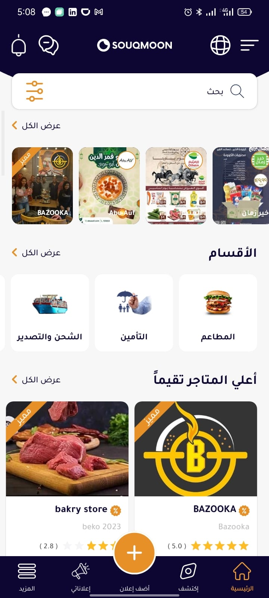 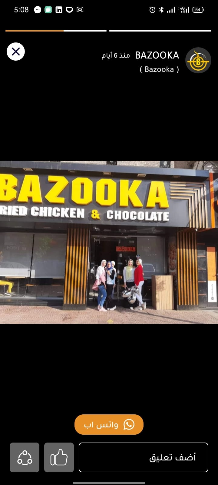

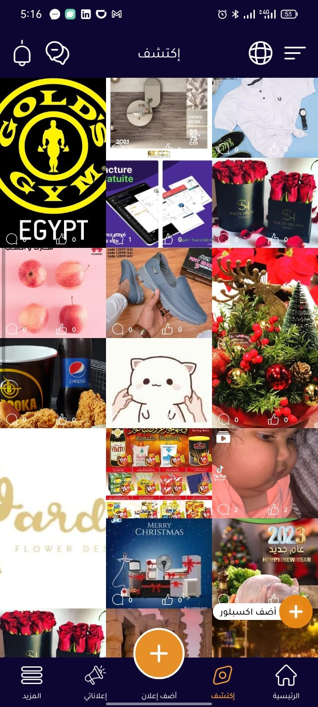 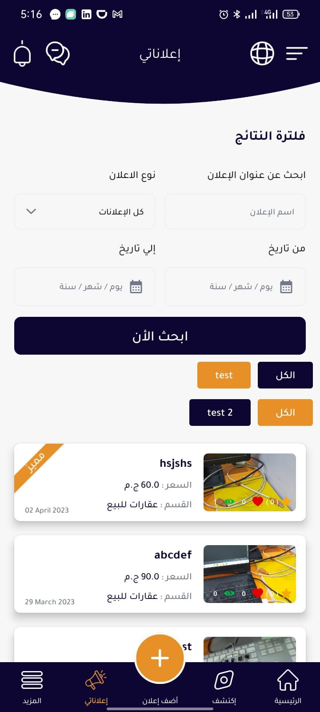

 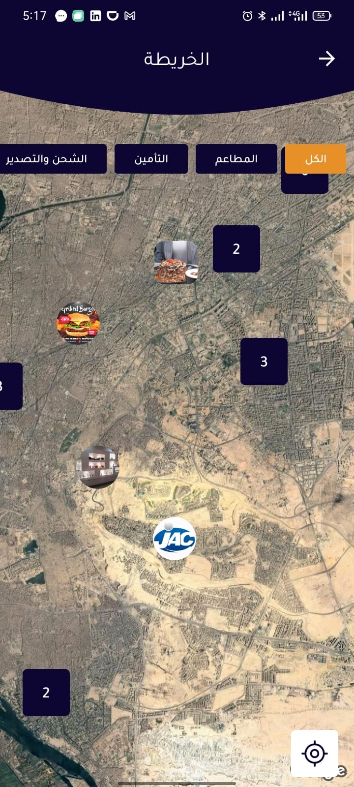

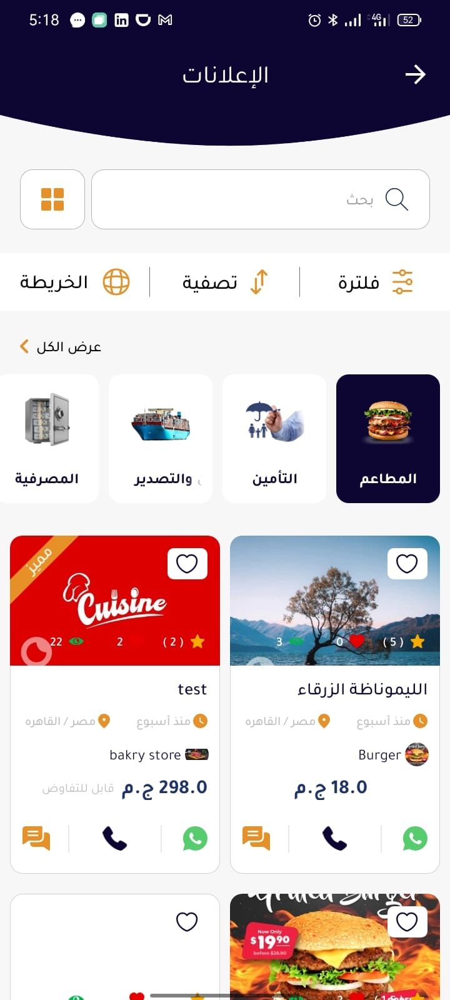 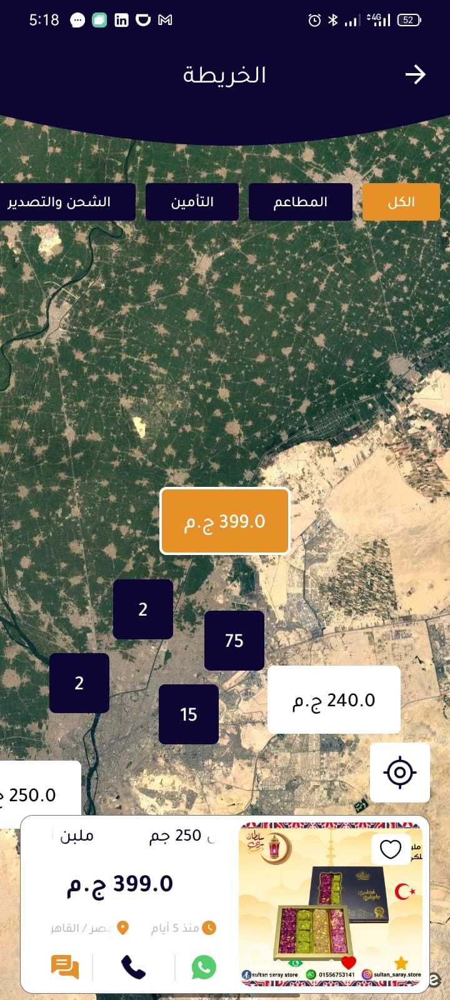

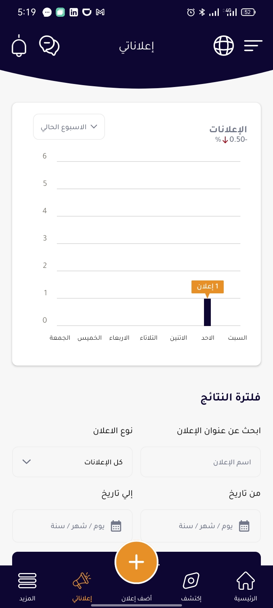 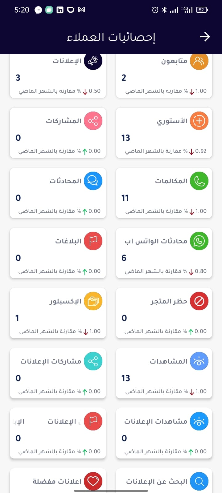

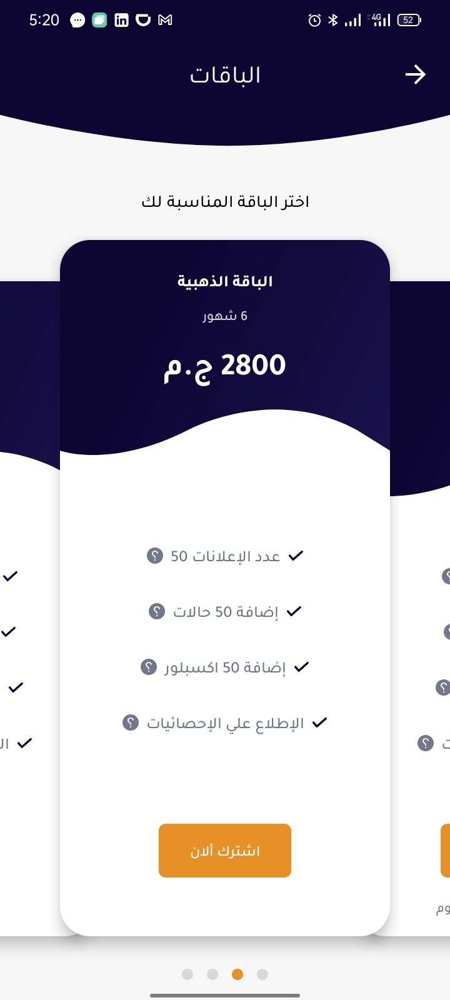 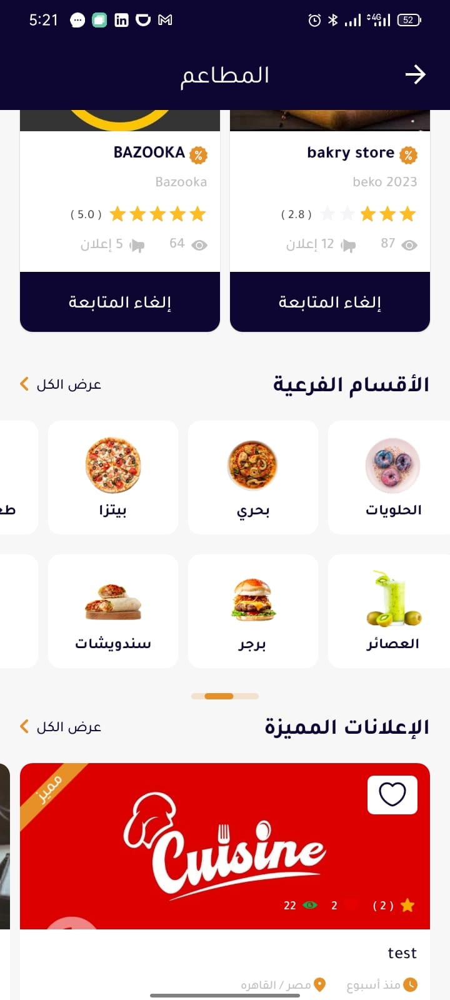

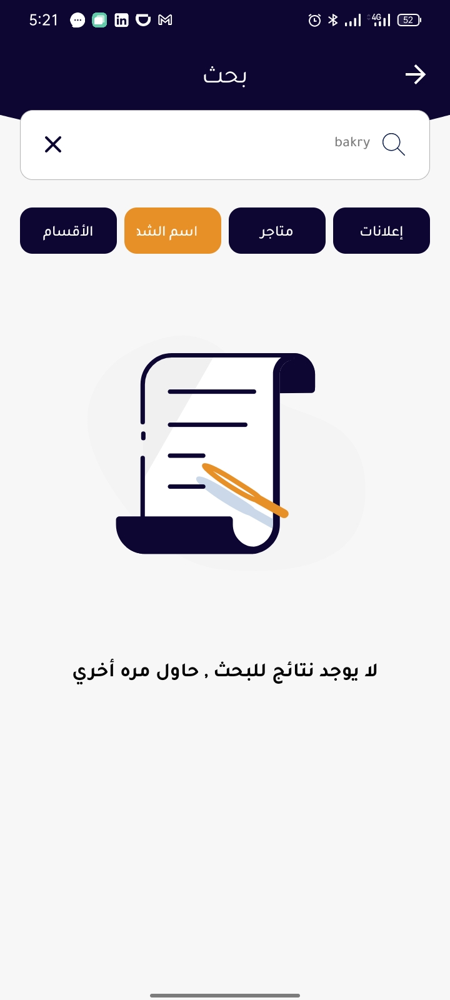 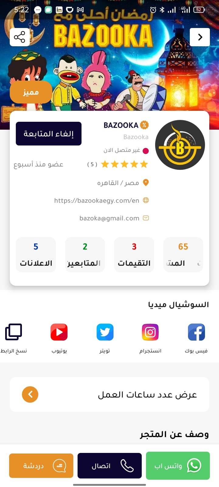

